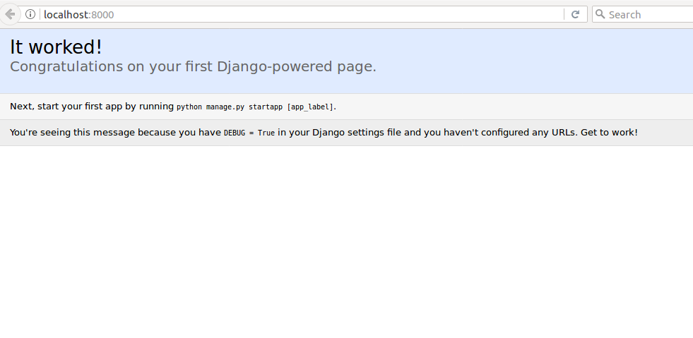
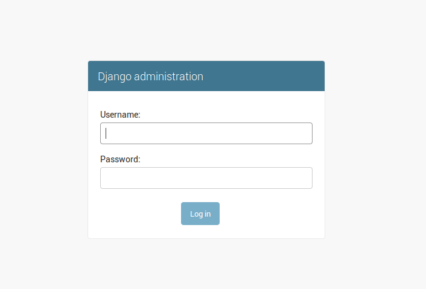
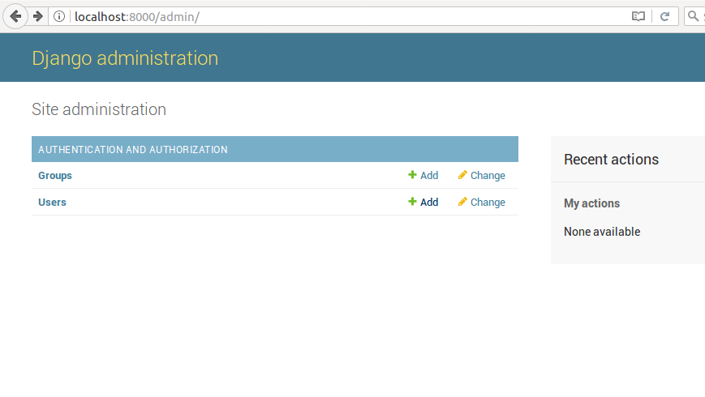
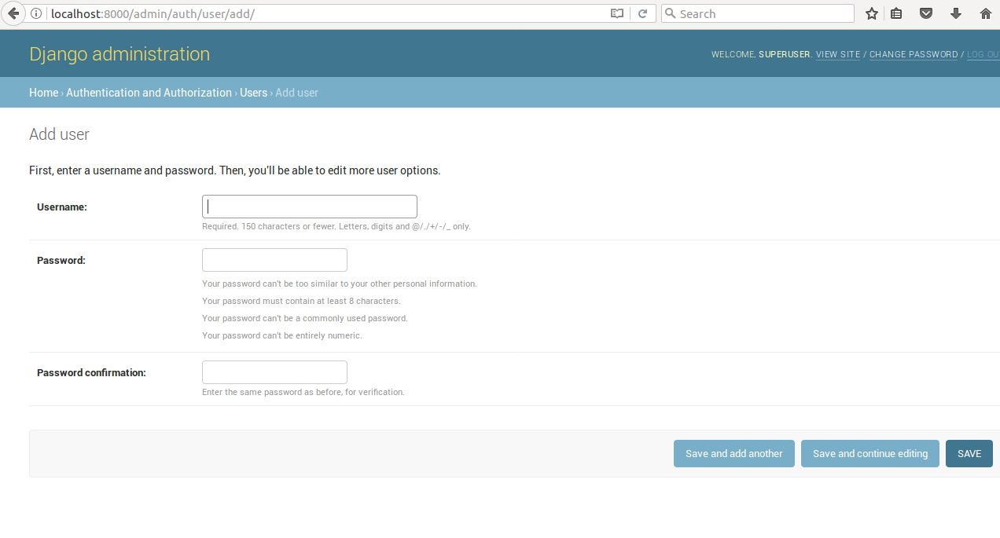

# Configuring Django to use PostgreSQL

## Introdution

**PostgreSQl**, often simply **Postgres**, is an object-relational database (ORDBMS) – i.e. an RDBMS, with additional (optional use) "object" features – with an emphasis on extensibility and standards compliance. As a database server, its primary functions are to store data securely and return that data in response to requests from other software applications.

PostgreSQL boasts sophisticated features such as Multi-Version Concurrency Control (MVCC), point in time recovery, tablespaces, asynchronous replication, nested transactions (savepoints), online/hot backups, a sophisticated query planner/optimizer, and write ahead logging for fault tolerance.

Django is a flexible framework for quickly creating Python applications. By default, Django applications are configured to store data into a lightweight SQLite database file. While this works well under some loads, a more traditional DBMS can improve performance in production.

In this tutorial, we'll demonstrate how to install and configure MySQL or MariaDB to use with your Django applications. We will install the necessary software, create database credentials for our application, and then start and configure a new Django project to use this backend.

## Prerequisites

A Ubuntu machine(requires **Sudo** privileges for user) with Internet.

## Install the Components from the Ubuntu Repositories

Our first step will be install all of the pieces that we need from the repositories. We will install pip, the Python package manager, in order to install and manage our Python components. We will also install the database software and the associated libraries required to interact with them.


The following apt commands will get you the packages you need:(thinking that you have configured python and)

```bash
sudo apt-get update
sudo apt-get install python-dev libpq-dev postgresql postgresql-contrib
```

With the installation out of the way, we can move on to create our database and database user.

## Create a Database and Database User

By default, Postgres uses an authentication scheme called "peer authentication" for local connections. Basically, this means that if the user's operating system username matches a valid Postgres username, that user can login with no further authentication.

During the Postgres installation, an operating system user named postgres was created to correspond to the postgres PostgreSQL administrative user. We need to change to this user to perform administrative tasks:

```bash
sudo su - postgres
```

You should now be in a shell session for the postgres user. Log into a Postgres session by typing:

```bash
psql
```

First, we will create a database for our Django project. Each project should have its own isolated database for security reasons. We will call our database myproject in this guide, but it's always better to select something more descriptive:

```sql
CREATE DATABASE sampleproj;
```

Remember to end all commands at an SQL prompt with a semicolon.

Next, we will create a database user which we will use to connect to and interact with the database. Set the password to something strong and secure:

```sql
CREATE USER sampleuser WITH PASSWORD 'password';
```

Afterwards, we'll modify a few of the connection parameters for the user we just created. This will speed up database operations so that the correct values do not have to be queried and set each time a connection is established.

We are setting the default encoding to UTF-8, which Django expects. We are also setting the default transaction isolation scheme to "read committed", which blocks reads from uncommitted transactions. Lastly, we are setting the timezone. By default, our Django projects will be set to use UTC:

```sql
ALTER ROLE sampleuser SET client_encoding TO 'utf8';
ALTER ROLE sampleuser SET default_transaction_isolation TO 'read committed';
ALTER ROLE sampleuser SET timezone TO 'UTC';
```

Now, all we need to do is give our database user access rights to the database we created:

```sql
GRANT ALL PRIVILEGES ON DATABASE myproject TO sampleuser;
```

Exit the SQL prompt to get back to the postgres user's shell session:

```sql
\q
```

Exit out of the postgres user's shell session to get back to your regular user's shell session:

```bash
exit
```

We will also install the psycopg2 package that will allow us to use the database we configured:

```bash
pip install django psycopg2
```

## Configure the Django Database Settings

We can now start a Django project within our sampleproj directory. This will create a child directory of the same name to hold the code itself, and will create a management script within the current directory. Make sure to add the dot at the end of the command so that this is set up correctly:

```bash
django-admin.py startproject sampleproj .
```

Now that we have a project, we need to configure it to use the database we created.

Open the main Django project settings file located within the child project directory:

nano ~/sampleproj/sampleproj/settings.py

Towards the bottom of the file, you will see a DATABASES section that looks like this:

```python
DATABASES = {
    'default': {
        'ENGINE': 'django.db.backends.sqlite3',
        'NAME': os.path.join(BASE_DIR, 'db.sqlite3'),
    }
}

```

This is currently configured to use SQLite as a database. We need to change this so that our PostgreSQL database is used instead.

First, change the engine so that it uses the postgresql_psycopg2 backend instead of the sqlite3 backend. For the NAME, use the name of your database (*sampleproj* in our example). We also need to add login credentials. We need the **username**, **password**, and **host** to connect to. We'll add and leave blank the port option so that the default is selected:

```python
DATABASES = {
    'default': {
        'ENGINE': 'django.db.backends.postgresql_psycopg2',
        'NAME': 'sampleproj',
        'USER': 'sampleuser',
        'PASSWORD': 'password',
        'HOST': 'localhost',
        'PORT': '',
    }
}

```

When you are finished, save and close the file.

## Migrate the Database and Test your Project

Now that the Django settings are configured, we can migrate our data structures to our database and test out the server.

We can begin by creating and applying migrations to our database. Since we don't have any actual data yet, this will simply set up the initial database structure:

```bash
cd ~/sampleproj
python manage.py makemigrations
python manage.py migrate
```

After creating the database structure, we can create an administrative account by typing:

python manage.py createsuperuser

You will be asked to select a username, provide an email address, and choose and confirm a password for the account.

Once you have an admin account set up, you can test that your database is performing correctly by starting up the Django development server:

python manage.py runserver 

In your web browser, visit your server's domain name or IP address followed by :8000 to reach default Django root page:
[localhost:8000](http://localhost:8000)

You should see the default index page:


Append `/admin` to the end of the URL and you should be able to access the login screen to the admin interface:



Enter the username and password you just created using the createsuperuser command. You will then be taken to the admin interface:





You have successfully set  as working database for 
