# Django installation on Ubuntu

## Introduction

Django is a  free and open-source web framework, written in Python, which follows the model-view-template (MVT) architectural pattern.Django's primary goal is to ease the creation of complex, database-driven websites. Django emphasizes reusability and "pluggability" of components, rapid development, and the principle of don't repeat yourself.

## Prerequisites

- Ubuntu - 64bit with python environment set.
- Root privileges.

> **Note**: If you don't know whether python is set or not follow this [tutorial](python.md)

## Step1- Setup python3 as default Python version

This step is necessary because python3 is current version and some of the python2 functions might get removed, So let's make sure default version is python3

```bash
python --version
Python 2.7.12
```
If you get output as above as `Python 2.7.x` follow the steps in qoute otherwise neglect the steps in quote.
> In terminal
> `update-alternatives --remove python /usr/bin/python2`
> `sudo update-alternatives --install /usr/bin/python python /usr/bin/python3 1`
We are done setting python3 as default python version in our machine.

## Step2- Installing Django using pip

Before installing Django let's install pip
```bash
sudo apt-get install python3-pip
```
you will get a output similar to following image


Now set pip of python3 as default

```bash
sudo ln -s /usr/bin/pip3 /usr/bin/pip
```
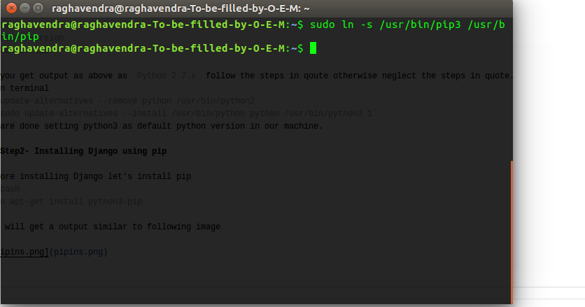

Now let's check whether pip is working or not

```bash
pip -V
```
The output will be in following manner

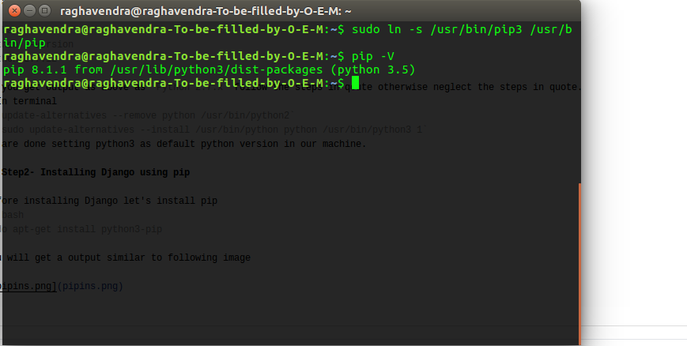

pip installation is done, now let's install django using pip.

```bash
sudo pip install django
```

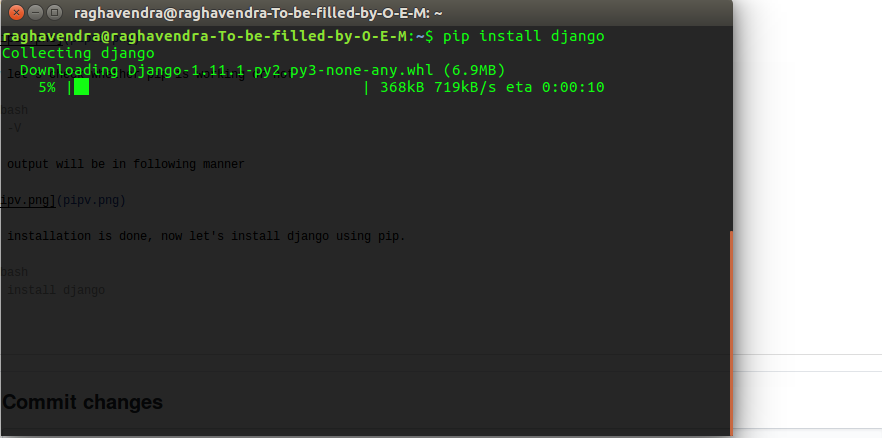

Now let's check whether django is installed or not 
```bash
django-admin --version
```
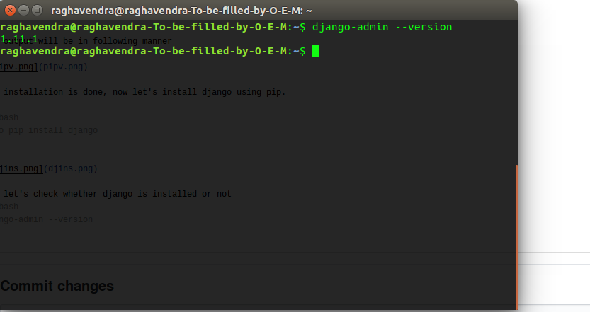

## Step3- Creating a sample project using Django

Create new folder for storing your Django project.

```bash
mkdir project1
cd project1
```
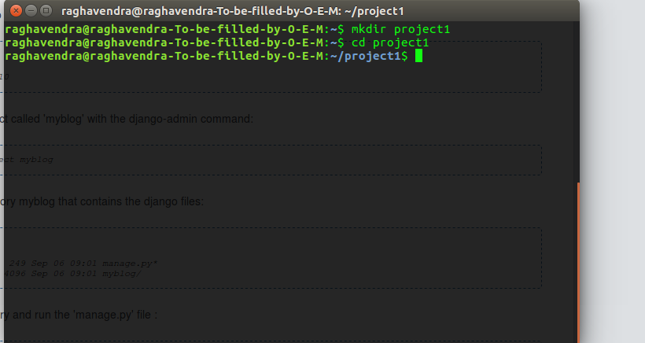

create a django project

```bash
django-admin startproject app
```
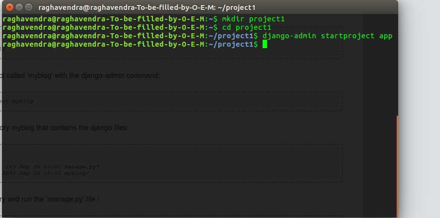

It creates app folder with django files.
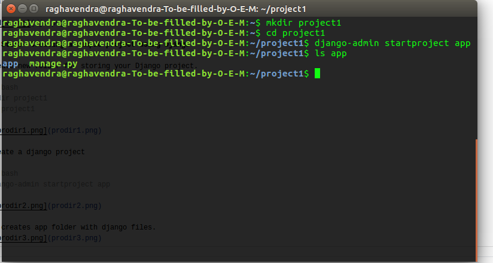

Now start migrate for necessary dependencies to avoid errors using *manage.py*.

```bash
cd app
python manage.py migrate
```
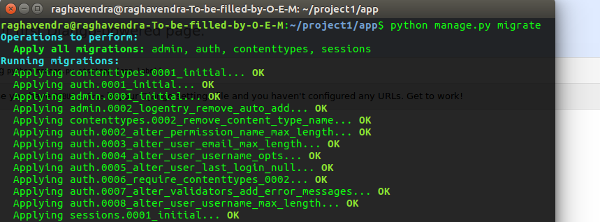

Let's get server working.
```bash
python manage.py runserver
```
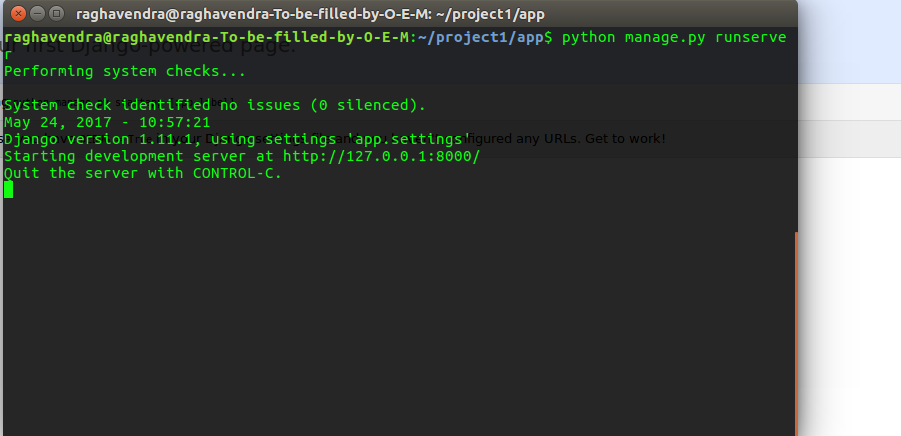

Check whether the server is working or not.

open [localhost:8000](http://localhost:8000/)

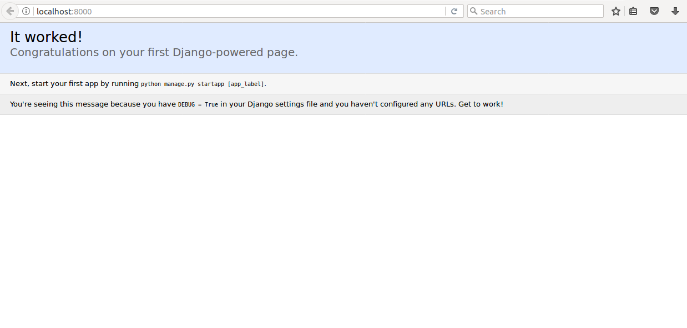

## Making a hello world app

create a application inside project folder.

```bash
django-admin startapp HelloWorldApp
```
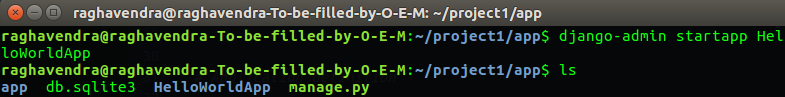

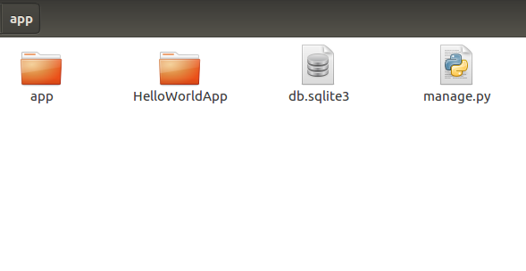

edit the *settings.py* and *urls.py* in project folder(folder name : *app* in my case).

- settings.py

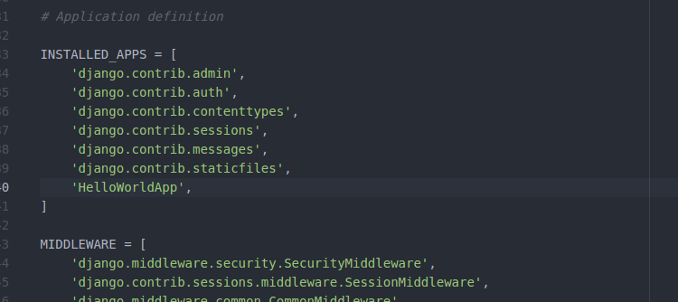


- urls.py

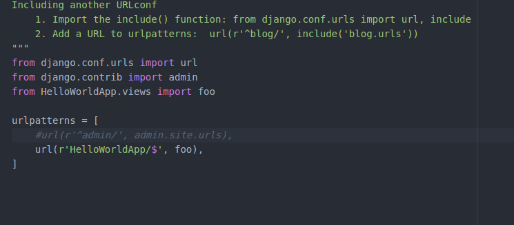


Edit *view.py* in *HelloWorldApp* folder.

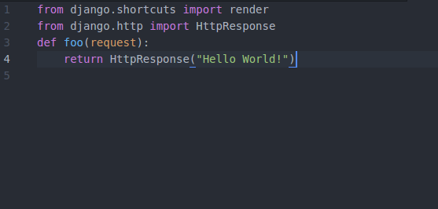

Open [localhost:8000/HelloWorldApp](http://localhost:8000/HelloWorldApp/) in browser by running server by `python manage.py runserver`.

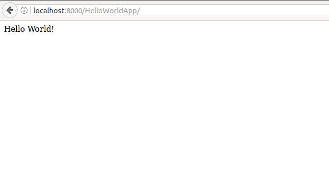

Wow!  :clap: you are now a Django developer.

### see also:
[setting **PostgreSQl** as database for Django](dbset.md)
