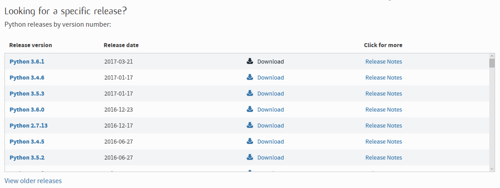
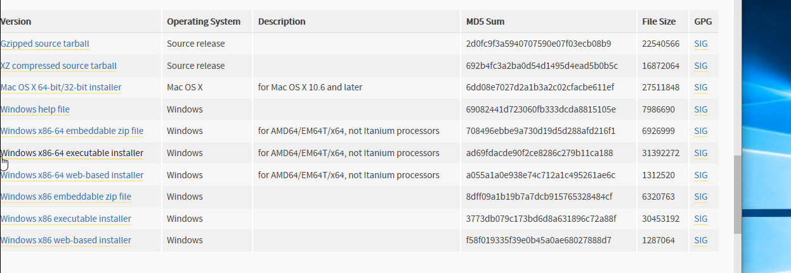
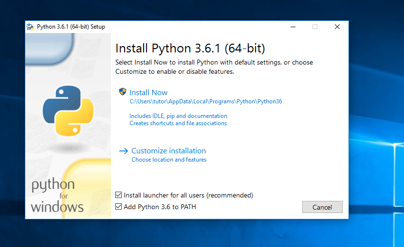
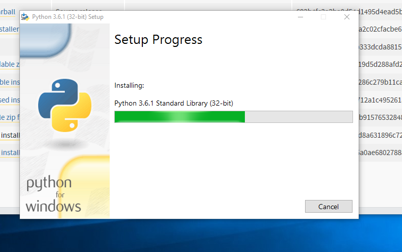
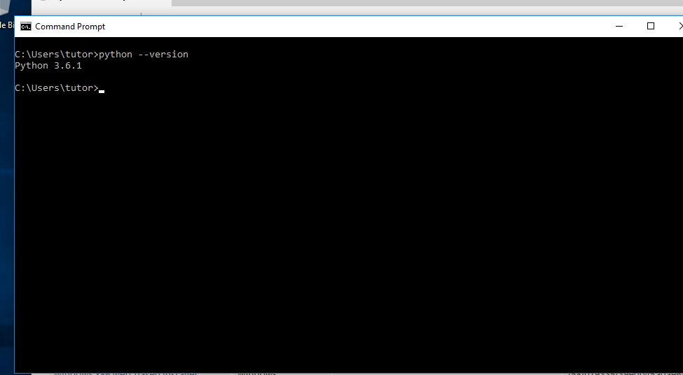
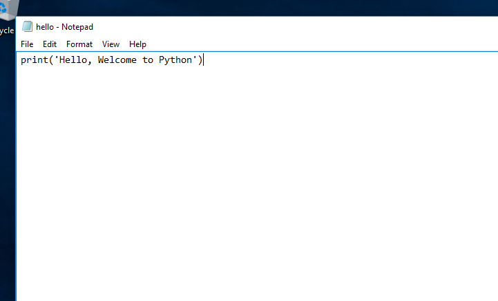
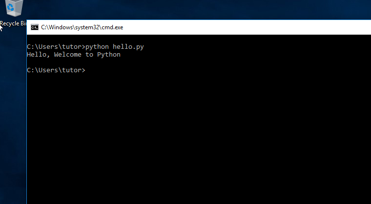
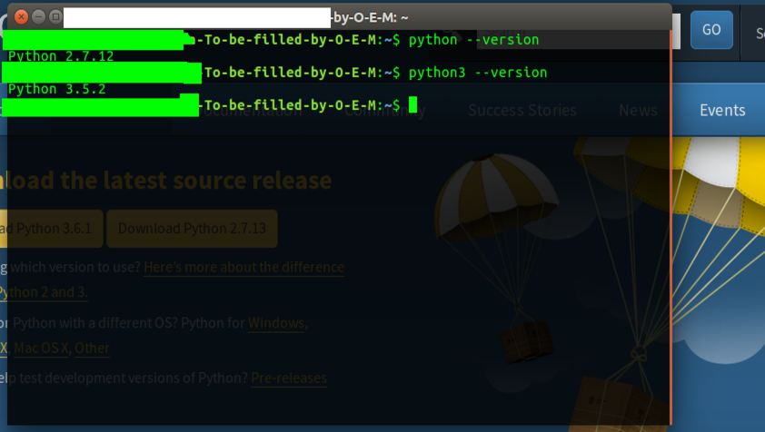
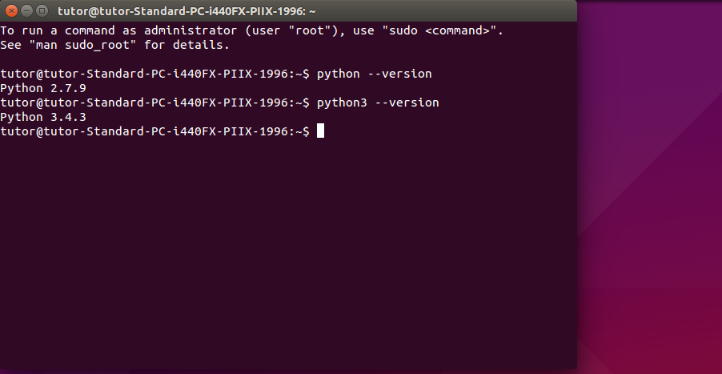

# How to Install Python and Set Up Programming Environment

## Quick Links
[Installation on Windows](#installation-on-windows)

[Installation on Ubuntu](#installation-on-ubuntu)

## Introduction

This tutorial will get you up and running with a local Python programming environment

Created in 1991 by Guido van Rossum, Python is a powerful and versatile high-level programming language. It is featured with immediate feedback on errors with relatively straightforward style coding and quite easy to set up. There are two major versions for Python namely 2.x and 3.x, 3.x is the current and considered future of language.

This tutorial will guide you through installing Python on your machine and setting up a programming environment via command line.

## Installation on Windows

### Prerequisites

A Windows PC with  internet.

### Step1-Download Python

- Open any internet browser and go to **[python.org](https://www.python.org/downloads/)** .

Select your version of interest.(3.x is recommended)



- Choose installer for download.



### Step2-Install Python and its components

- After completion of download open the installer and select **install now** and **Add python to path** for installing python components such as pip and adding python to path.





### Step3-Setting up path and testing environment

- Wait for installation to complete it may take a while.

- Now let us check whether the environment is working or not.

Open command prompt and type 
```bash
python --version

```


- If you did'nt get version as in above image that means you either did'nt choose add python to path or you went for custom installation. 

- No worries, you can add python to path by yourselves by 
Go to `Control Panel > System and Security > System` go for `Advanced system setting > Environment Variables` and then select path, edit the path by adding  `C:\Users\ *username*\App Data\Local\Programs\Python\ *Pythonfoldername*` if python was installed users folder otherwise add `C:\ *Python folder name*`.

- Now python environment works. Lets test with a hello program then.
Open notepad and write a hello program as below and save it with *.py* extension.
```python
print('Hello, Welcome to Python')
```


Now open command prompt at location(press *Shift+Mouse Right Click*) of *.py*(python file) file and type `python hello.py`(in my case). It gives an output as follows.

```bash
Hello, Welcome to Python
```


Congos! :sunglasses: you successfully installed and did set up the Python programming environment in your Computer :clap:.

## Installation on Ubuntu

### Prerequisites

A Ubuntu machine with internet and root access.

### Setting up Python

- We are using non graphical way(using command line) for setting up python in your machine.On both Ubuntu 16.04 and 15.04, you can find terminal application by either clicking **ctrl+Alt+t** or using the search by pressing **ubuntu button**. 


Ubuntu ships with both Python 3 and Python 2 pre-installed. To make sure that our versions are up-to-date, let’s update and upgrade the system with `apt-get`:

```bash
sudo apt-get update
sudo apt-get -y upgrade
```

Once the process is complete, we can check the version of Python  that is installed in the system by typing: 

```bash
python --version
python3 --version
```
16.04(customized the profiles of terminal, so don't panic if you see a different coloured terminal)



15.04



The output should be similar to above images(the version may vary).


To manage software packages for Python, let’s install **pip**:

```bash
sudo apt-get install -y python3-pip
```
**pip** is a package manager that manages the programming packages in developing projects.

we can install new packages using pip by:

`pip install `*packagename*

There are a few more packages and development tools to install to ensure that we have a robust set-up for our programming environment:

```bash
sudo apt-get install build-essential libssl-dev libffi-dev python-dev
```
Congos! :sunglasses: you successfully  set up the Python programming environment in your Computer :clap:.

#### Similar:
- [Install Django on Ubuntu](django.md)
- [Install Django on Windows]()
